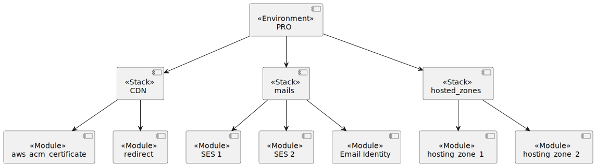

# Infrastructure

Repository to gather terraform scripts for setting up infrastructure for CoPotrzebne.pl.

## Folder structure

```
.
├── environments
│   ├── dev
│   │   ├── stack-1
│   │   │   └── ...
│   │   ├── stack-2
│   │   │   └── ...
│   │   └── config.sh
│   └── pro
│       ├── stack-1
│       │   └── ...
│       ├── stack-2
│       │   └── ...
│       └── config.sh

├── modules
│   ├── module-1
│   │   └── ...
│   └── module-2
│       └── ...
└── stacks
    ├── stack-1
    │   └── ...
    └── stack-2
        └── ...
```

Example structure:



### `environments`

Contains deployable modules grouped per environments (i.e. `dev`, `pro`) and stacks (i.e. `cdn`, `hosting_zones`).

Each environment contain file `config.sh` with global configuration (for environment)
which could be stored in the repo (should not contain any credentials!).

Why config is not kept in `tfvar` file? To prevent warnings from Terraform about undefined variables
occurring when not all global variables are used by the stack (only environment variables `TF_VAR_*` could be used
without this warning).

#### `stacks`

Each of the stacks is deployed separately and stored in a separate `tfstate`.

Main files:

* `config.tf` - backed definition where state will be stored and provider configuration
* `main.tf` - the main fail with infrastructure - should contain mostly references to existing, reusable stacks
  from directory `stacks`.
* `outputs.tf` - optional file with output variables
* `variables.tf` - list of variables

### `modules`

Reusable Terraform modules.

Main files:

* `main.tf` - the main fail with infrastructure
* `outputs.tf` - optional file with output variables
* `variables.tf` - list of variables

### `stacks`

Reusable Terraform modules contains multiple modules, connected togather, run on environment.

Stack prevents duplication, and allow to keep environments similar as possible - small diffrences could be
added per env.

Main files:

* `main.tf` - the main fail with infrastructure
* `outputs.tf` - optional file with output variables
* `variables.tf` - list of variables

## Getting Started

Instructions of setting up your project locally. Follow these simple steps.

### Prerequisites

* Configured AWS profiles with names: `copotrzebne-dev`, `copotrzebne-pro`
* Required software installed using commands:

  ```bash
  make configure
  ```

### Usage

Here is a list of commands which you will find useful when working with this repo.

```bash
# Set AWS Profile
export AWS_PROFILE=copotrzebne-dev

# Load Terraform version based on .terraform-version file
tfenv use

# Go to stack which you want to deploy
cd environments/dev/cdn/

# Initialize a working directory and install dependencies (terraform modules)
source ../config.sh && terraform init

# Verify files (run linters)
pre-commit run --all-files

# Verify changes which will be applied on AWS
source ../../config.sh && terraform plan

# Deploy changes: Do it only when you are sure of what you are doing!
source ../../config.sh && terraform apply
```

Please ignore warnings:

- `Value for undeclared variable`
- `Values for undeclared variables`

are caused by unused variables by stacks defined in configuration (`tfvars` file)

To simplify work you can use command defined in `Makefile`:

```bash
# Define which AWS credentials should be used
export AWS_PROFILE=copotrzebne-prod

# To initiate project and install terraform modules
make init env=<env> stack=<stack>

# To validate project
make check

# To verify what changed will be deployed
make plan env=<env> stack=<stack>

# To deploy changes
make apply env=<env> stack=<stack>

# You can run multiple commands at once
make check plan env=<env> stack=<stack>

# Display outputs
make output env=<env> stack=<stack>

# Display secret output
make output-raw name=<name> env=<env> stack=<stack>
```

where

* `<stack>` - name of supported stacks, i.e. `cdn`, required
* `<env>` - AWS account: `dev` or `pro`, default: `dev`

## Deployment

~~Changes are deployed to AWS after push to branch `main` (when pull request is merged).~~

## AWS

AWS account:

* Dev account: `933930654998`
* Pro account: `432456784825`

## Links

* [How to use domain with Amazon SES in multiple accounts or regions](https://aws.amazon.com/blogs/messaging-and-targeting/how-to-use-domain-with-amazon-ses-in-multiple-accounts-or-regions/)
* [Importing Existing Infrastructure into Terraform](https://spacelift.io/blog/importing-exisiting-infrastructure-into-terraform)

## Licence

[GNU General Public License v3.0](LICENSE)
